# rendersi1
rendersi1 is a personal renderer for demo purpose, easy to use and maintain.\
[nmsplib](https://github.com/wai3aa1sam/nmsplib) - personal C++ library


**Table of Contents**
- Requirement
- Build
- Demos
- Features
- Architecture / Design
- Roadmap
- References

## Requirement

- Visual Studio 2022 (C++17)
- Windows only (sdk: 10.0.22621.0, only tested in Windows 10)
- Vulkan 1.3.283.0 or above (download from https://www.lunarg.com/vulkan-sdk/)
- CMake 3.25
- Python 3.12.0 or above

## Build

```
script/generate_project/install_vcpkg_packages.bat
script/generate_project/gen_vs-2022.bat
build/rendersi1-x64-windows/rendersi1.sln
```
- if failed to generate visual studio solution, probably due to fail to install packages in vcpkg, please execute the above step once more.

- if your machine has different version of vulkan sdk, please pass a root path to Vulkan_findPackage() in CMakeLists.txt or set the environment variable [VULKAN_SDK]

- if the vulkan validation layer has link to different version, please open vkconfig.exe and check the version in VkLayer_override.json\
details: [https://vulkan.lunarg.com/doc/view/1.3.283.0/windows/layer_configuration.html]

## Demos

### Forward Plus Rendering

| fwdp | light heatmap | with frustum culling |
|---|---|---|
|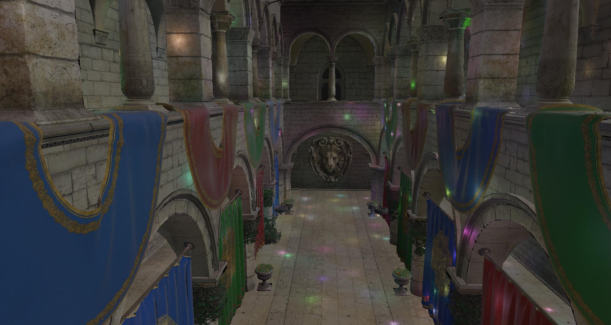|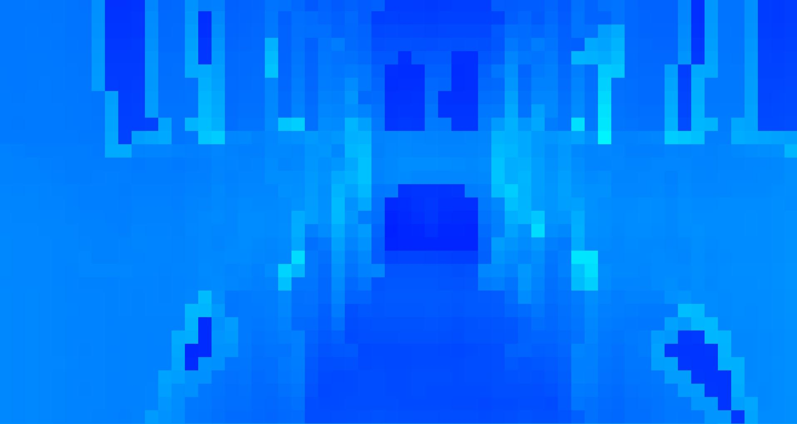|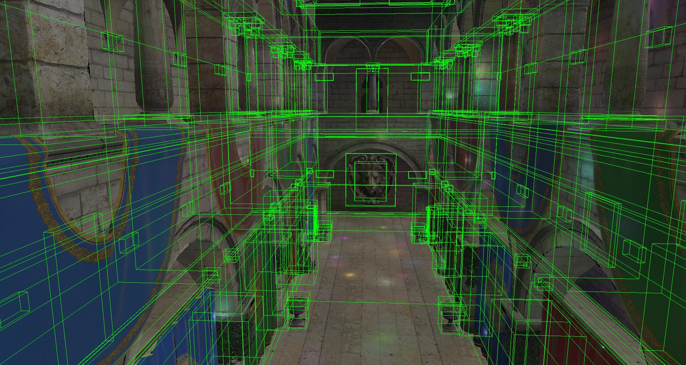

### Render Graph

| graph visualization | profile with tracy |
|---|---|
|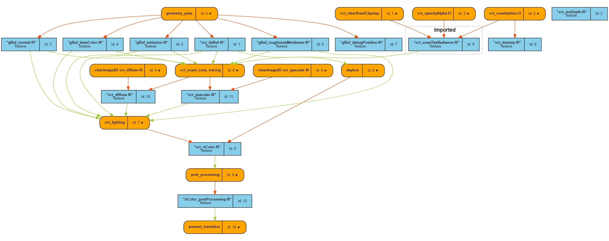|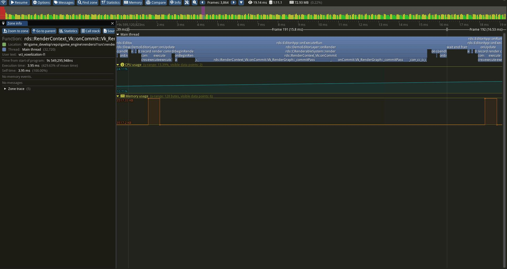|

### Voxel Cone Tracing (wip)

| voxelization | voxel wireframe | clipmap |
|---|---|---|
|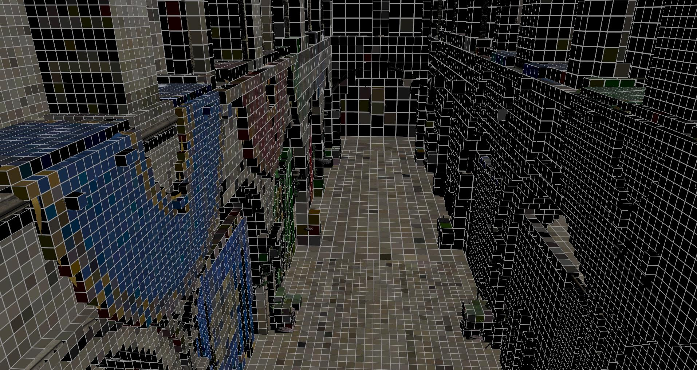|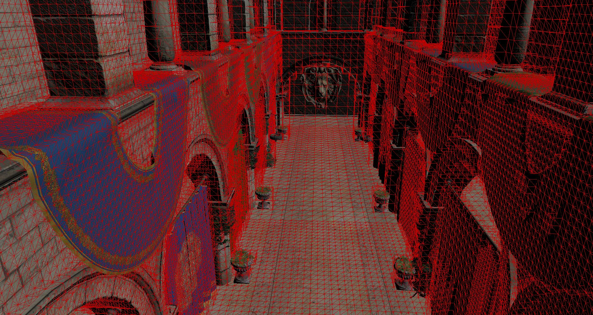|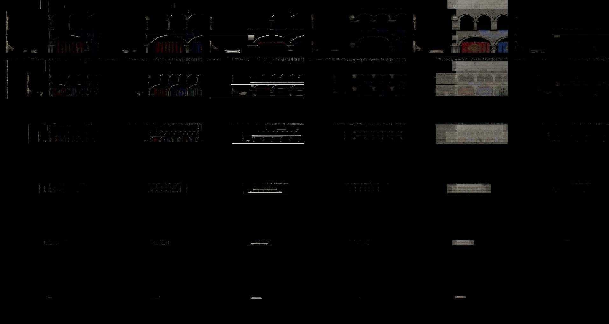|

### Physical Based Rendering

| pbr | pbribl |
|---|---|
|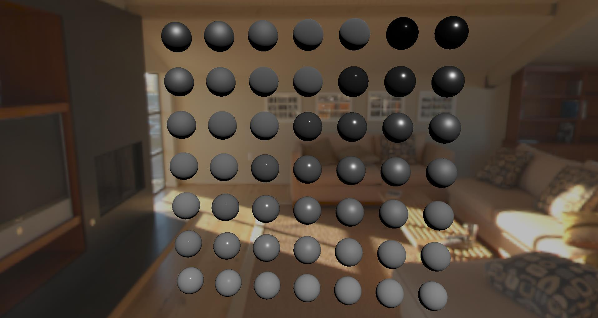|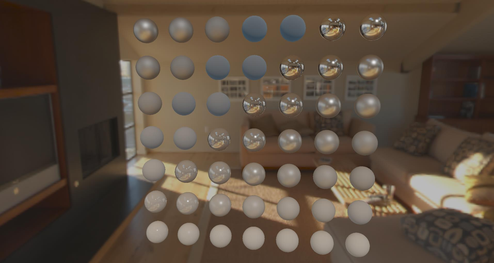|

### Cascaded Shadow Maps (wip)

| csm | cascade level |
|---|---|
|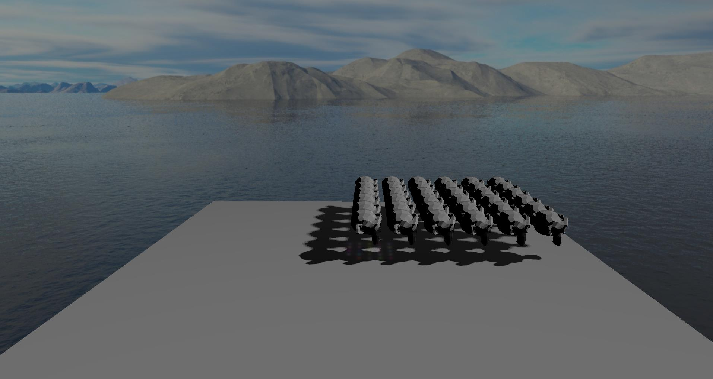||

## Features

- bindless rendering pipeline
- render pass feature
- shader hot reload
- ecs
- job system
- editor ui
- allocator interface

## Architecture / Design

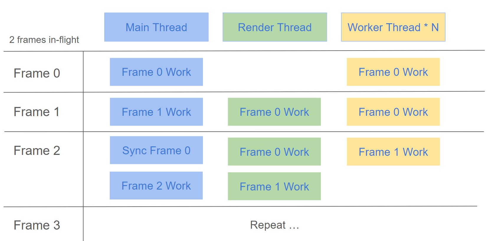

Work in progress to a multi-thread design. Support n frames in-flight, Sync only when the previous n frames has not yet completed. \
Main thread handle all game logic and record render commands, it could dispatch workload to worker threads. \
Render thread resolve those render commands to backend graphics api commands. It works as worker thread when there is no commands.

- pros
  - no lock is needed
  - easy to multi thread
  
- cons
  - memory usage will increase n times (multi buffer)

## Roadmap

- engine

  - multi thread design

- rendering

  - debug vxgi
  - atmospheric scattering
  - bloom
  - screen space reflection
  - cascaded shadow map
    - [ ] blend between cascade level
    - [ ] fix visual problem

- render api
  
  - enhance render graph
    - [ ] async compute
    - [ ] reorder
    - [ ] resource alias
    - [ ] dump graph with extra info (vk transition / our StateTrack)
  - revise texture upload
  - render queue
  

## References

please go to [reference](doc/reference/reference.md)